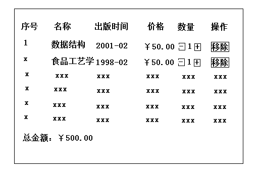

### VUE

Vue是一个渐进式的前端框架

### bind动态绑定 ：

语法糖 `:`，绑定**一切属性**，如value，css，src等等，以及其他自定义的属性

举两个例子，其他类似推导即可：

1. 绑定class
2. 绑定style

```html
<a :class= '{active: true}'> <!--绑定class 常用-->
<a :style= '{font-size: '50px'}'> <!--绑定style-->
<!--都采用对象语法绑定，因为常用-->
```

案例：点谁，谁变色

我一般称他为`海王案例`

```html
  <div id='app'>
    <ul>
      <li v-for='(movie, index) in movies' :class='{active: currentIndex === index}' @click='currentIndex = index'>
        {{movie}}
      </li>
    </ul>
  </div>

  <script src='./vue.js/vue.js'></script>
  <script>
    const vueins = new Vue({
      el: '#app',
      data: {
        movies: ['海王', '海王1', '海王2', '海王3', '海王4'],
        currentIndex: -1 // ***重点，缓存状态用
      },
      computed: {
      }
    })
  </script>
```

计算属性

他的行为是属性，而它本身是一个函数。也就是说它可以被绑定

一般用在：对data中的数据进一步加工再返回使用。哪为什么不用methods呢？

因为：计算属性1.缓存机制，提高效率 2.还没想到，额

### 事件监听 @

注意两个点：

参数问题

修饰符

```html
<script>
// 下面是一个监听函数，参数问题
methods:{
    btnClick($event){
        $event  // 如果不传入参数，则默认第一个参数为event对象
    }
    btnClick2(name, $event){
        $event  // 如果传入第一个参数，但又想拿$event对象，则首先绑定时用$event传入参数，例如：<a @click='btnClick(name, $event)'>
    }
   	// 也就是说，尽量保证两个参数一样（标签的参数和方法的参数）
}
</script>


<!-- 
修饰符
例如：阻止冒泡事件、清除默认事件、键盘按下事件等等
    .stop 阻止冒泡事件 常用
    .prevent 清除默认事件 常用
    .capture 
    .self
    .once 只触发一次事件
    .passive
详细文档：
https://cn.vuejs.org/v2/guide/events.html#%E4%BA%8B%E4%BB%B6%E4%BF%AE%E9%A5%B0%E7%AC%A6
-->
<!-- 提交事件不再重载页面 -->
<form v-on:submit.prevent="onSubmit"></form>

```

### 遍历

v-for可以遍历对象和数组，官方叫[列表渲染](https://cn.vuejs.org/v2/guide/list.html)

注意点：一般遍历的时候**绑定**一个key属性（要保证唯一，否则无效），提高效率，原因见：

```html
    <ul>
      <li v-for='(movie, index) in movies' :key='movie'>
        {{movie}}
      </li>
    </ul>
```

案例：图书购物车



此案例用到了过滤器，很简单

对数据再次处理后，返回

```javascript
{{price | showPrice}}

filters:{
	showPrice(price){ // 自动传入参数
			price += 1 // 处理数据
	}
	return price // 返回处理后的结果
}
```

### 双向绑定

v-model原理：v-model = bind + on ，也就是绑定属性+事件监听

bind是单向绑定属性

事件监听可以监听属性，将属性传回vue对象

懒加载

v-model.lazy = 'name' 等待name完全更新再加载

案例：输入什么，显示什么

### （重点）组件化

思想：组件树


组件树类似继承

组件注册：全局和局部

```javascript
// 全局注册
Vue.component(组件名，组件对象)
// 局部注册 常用
components:{
    组件名：组件对象
}
```

一个例子：


```javascript
// 使用标签
<child ref='child1'></child>

// 定义模板
<template id="tmp1">
    <div>
    <span>我是子组件</span>
</div>
</template>

const child = {
    name:'child',
    template: '#tmp1',
}
// vue实例中：
components:{
	child // 注册组件
},
```

由于一个个组件也相当于一个个Vue实例，所以数据是独立的，下面就是通讯了

##### 父子通讯

父传子：父类通过属性绑定传递参数，然后子类定义props:{ name:{type: String, default: '默认值'} } 拿到参数

子传父：父类监听事件，子类通过触发自定义事件传递参数

##### 父子组件数据双向绑定


##### 父子对象访问

```javascript
// 父访问子组件对象
this.$refs // [常用]访问定义了ref属性的标签，当然也包括了子组件
// 例如标签<button ref='profile'></button>
this.$refs['profile'] // 访问ref属性为profile的标签
this.$children // [很少用]

// 子访问父组件对象
this.$parent // [很少用]

// 访问根vue实例
this.$root // [很少用]
```

##### （重点）插槽

思想：扩展、开放、动态数据

三类插槽：默认插槽、具名插槽、作用域插槽

```html
<!--默认插槽-->
<!--child子组件中定义-->
<div>
    <span>我是子组件</span>
    <slot>我是插槽默认值</slot>
</div>
<!--使用-->
<child>哈哈哈，我要替换slot<child>
    
    
<!--具名插槽-->
<div>
    <span>我是子组件</span>
    <slot name='slot1'></slot>
    <slot name='slot2'></slot>
</div> 
<!--使用-->
新方法
<child>
    <template v-slot='slot1'>
    哈哈哈，我要替换slot1
    </template>
    <template v-slot='slot2'>
    哈哈哈，我要替换slot2
    </template>
<child>
老方法：此方法在2.6.0版本上已被废弃
<child slot='slot1'>哈哈哈，我要替换slot1<child>
    
    
<!--作用域插槽-->
自 2.6.0 起有所更新。已废弃的使用 slot-scope
这也是一种子类给父类传递参数的途径
<!--使用-->
    <child ref='child1'>
        <template v-slot:slot1='slotProps'> 获取参数
        <template #slot1='slotProps'> 缩写#获取参数
        <template #default='slotProps'> 获取默认插槽
            slot.user{{slotProps.user}}
        </template>
    </child>
    <div>
        <span>我是子组件</span>
        <slot :user='user' name='slot1'></slot> 绑定要传递的属性，给父类
        <!--这相当于父类给子类props传递参数-->
    </div>
```

### Vue CLI

脚手架，源于建筑学一次，表示框架，骨架的意思。也就是说这玩意能够搭建一些东西：

webpack配置、vue配置、vue-router配置、vuex配置等

```javascript
npm install -g @vue/cli // 获取最新cli版本
npm install -g @vue/cli-init // 拉取模板，从而来支持cli2

vue init webpack 项目名 // 创建cli2.0项目
vue create 项目名 // 创建cli2.0以上版本项目

// vueCLi3.0自己增加配置文件
// 项目根目录简历vue.config.js，这个文件会被cli加载
```

##### 知识点：runtime-compiler与runtime-only区别？

vue运行过程：template-> ast-> render-> virual dom-> UI

ast：抽象语法树

runtime-compiler从头到尾

而runtime-only从render那里开始，省去了两个步骤，所以效率更高、代码量更小

##### 那render是什么？

```javascript
render(h){
	h(App) // h是一个元素创建方法，能够根据App的内容创建相应标签，最终形成virtual dom
}
// h(标签名，标签属性，标签内容)
// 标签内容可以是另一个标签，可以嵌套
```

### 路由

[Vue-Router官网](https://router.vuejs.org/zh/) 参考更多详尽信息

路由分为前端路由和后端路由

前端路由目的：无刷新请求、SPA（单页面富应用）

SPA：Single Page Application


无刷新请求不同网页方式：hash和history

```javascript
history.pushStatej(data, title, url) // 压入路径栈
// URl必须和当前页面的URL属于同一个源（即不能跨域），否则会有很大的安全漏洞
history.replaceState(data, title, url) // 替换栈顶路径

history.go(数字)
history.back() == go(-1)
```

##### （重点）vue-router

```javascript
npm install --sava vue-router

// 大体流程：导入->配置->挂载
// 跟大多数插件使用流程类似

// index.js中
import VueRouter from 'vue-router'
Vue.use(VueRouter)
const router = {
    routes:[
        {
            path:''
            redirect: '/home' // 重定向
        }
        {
            path:'/home'
            component: Home
        }
    ]
}
export default router

// main.js中
import router from './index.js'
new Vue({
    router // 挂载到vue实例上
})
```

使用路由

```html
<router-link to='/home' tag='button'></router-link> <!--定义跳转路由-->
<!--
当然也可以手动跳转，因为全局挂载了一个router：
	this.$router.push('/home')
	this.$router.replace('/home')
tag: 表示渲染成什么标签，默认渲染为a标签
-->

<router-view></router-view> <!--占位，为了显示-->
```

##### 路由传参

param和query

```html
<router-link to='/home/:id' tag='button'></router-link>
:id就可以获取到参数，访问this.$route.params.id
```

```javascript
this.$router.push({'/home', query:{name: 'zhangsan'})}) // 传递
this.$route.query.name
```

##### 导航卫士

也就是钩子函数

三种：全局导航卫士、路由导航卫士、组件导航卫士

全局：beforeEach、afterEach、beforeResolve（解析钩子）

```javascript
router.beforeEach((to, from, next)=>{
    next() // 必须调用，保持原始正常
})
```

路由：beforeEnter

```javascript
routes: [
    {
      path: '/foo',
      component: Foo,
      beforeEnter: (to, from, next) => {
        // ...
      }
    }
  ]
```

组件：beforeRouteEnter、beforeRouteUpdate、beforeRouteLeave

```js
  template: `...`,
  beforeRouteEnter (to, from, next) {
    // 在渲染该组件的对应路由被 confirm 前调用
    // 不！能！获取组件实例 `this`
    // 因为当守卫执行前，组件实例还没被创建，其他两个钩子不受影响
      
    console.log(this); // undefined
    next((vm) => {
      console.log(vm.$route.query);
      // 这里可以访问vue实例，因为这个钩子调用时，vue还没有生成
    }); // 必须调用next()，保证正常工作
  },
```

##### $router与$route

router：整个路由对象

route：当前活跃对象

##### keep-alive

将router-view放入keep-alive标签中，其行为就会被缓存

```js
<router-view include='Home,About'> // 根据name属性识别
<router-view exclude='Home,About'> // 根据name属性识别
```

[keep-alive更加详尽看这里](https://cn.vuejs.org/v2/api/#keep-alive)

这里就引出两个组件钩子函数：actived、deactived（活跃，不活跃）

如果不存在keep-alive则无效

### （重要）案例：tabbar

模样


### Vuex

vuex集中式储存管理，其实就是一个全局变量，而且是一个数据双向绑定的全局变量。

```js
$store
{
    state, mutations, getters, actions, moduleds
}
```

```js
npm install --save vuex

// store.js
import Vuex from 'vuex'
Vue.use(Vuex)
const store = new Vuex.store()
export default store

// 挂载
import store from './store.js'
new Vue({
    store
})
```


也就是组件要更新states（储存变量的对象），那么只用通过两种路径：

1. actions-> mutations-> states
2. mutations-> states

```js
this.$store.dispatch()
this.$store.commit(事件名称, 参数) // 事件名称为mutations中定义的方法名称
this.$store.commit({type: 事件名称, 参数}) // 官方称这个参数为荷载
```

##### mutations

```js
{
    state: ...,
    mutations:{
        increament(state, 外部传入参数){}
    }
}
```

Mutation 需遵守 Vue 的响应规则

既然 Vuex 的 store 中的状态是响应式的，那么当我们变更状态时，监视状态的 Vue 组件也会自动更新。这也意味着 Vuex 中的 mutation 也需要与使用 Vue 一样遵守一些注意事项：

1. 最好提前在你的 store 中初始化好所有所需属性。
2. 当需要在对象上添加新属性时，你应该

- 使用 `Vue.set(obj, 'newProp', 123)`, 或者
- 以新对象替换老对象。例如，利用[对象展开运算符](https://github.com/tc39/proposal-object-rest-spread)我们可以这样写：

```js
state.obj = { ...state.obj, newProp: 123 }
```

##### actions

actions其实是包装了一下mutations，因为mutations不允许有异步的操作。

```js
mutations: {
    increment (state) {
        state.count++
    }
},
actions: {
    increment (context) { // store 实例具有相同方法和属性的 context 对象，但却不是store
        // ...异步操作
        context.commit('increment')
    }
}

this.$store.dispatch(事件名称，参数).then() // 分发 Action
```

```js
// 假设 getData() 和 getOtherData() 返回的是 Promise

actions: {
  async actionA ({ commit, state }) { // 从context中结构commit和state
    commit('gotData', await getData())
  },
  async actionB ({ dispatch, commit }) {
    await dispatch('actionA') // 等待 actionA 完成
    commit('gotOtherData', await getOtherData())
  }
}
```

> 一个 `store.dispatch` 在不同模块中可以触发多个 action 函数。在这种情况下，只有当所有触发函数完成后，返回的 Promise 才会执行。

##### module

```js
const moduleA = {
    state: () => ({ ... }),
    mutations: {
      increment (state) {
      // 这里的 `state` 对象是模块的局部状态
    state.count++
    }
  },
  actions: { ... },
  getters: { 
      doubleCount (state) {
      	return state.count * 2
      }
  }
}

const moduleB = {
  state: () => ({ ... }),
  mutations: { ... },
  actions: { ... }
}

const store = new Vuex.Store({
  modules: {
    a: moduleA,
    b: moduleB
  }
})

store.state.a // -> moduleA 的状态
store.state.b // -> moduleB 的状态
```

同样，对于模块内部的 action，局部状态通过 `context.state` 暴露出来，根节点状态则为 `context.rootState`：

```js
const moduleA = {
  // ...
  actions: {
    incrementIfOddOnRootSum ({ state, commit, rootState }) {
      if ((state.count + rootState.count) % 2 === 1) {
        commit('increment')
      }
    }
  }
}
```

对于模块内部的 getter，根节点状态会作为第三个参数暴露出来：

```js
const moduleA = {
  // ...
  getters: {
    sumWithRootCount (state, getters, rootState) {
      return state.count + rootState.count
    }
  }
}
```

命名空间

默认情况下，模块内部的 action、mutation 和 getter 是注册在**全局命名空间**的——这样使得多个模块能够对同一 mutation 或 action 作出响应。

如果希望你的模块具有更高的封装度和复用性，你可以通过添加 `namespaced: true` 的方式使其成为带命名空间的模块。当模块被注册后，它的所有 getter、action 及 mutation 都会自动根据模块注册的路径调整命名。

[更深入命名空间](https://vuex.vuejs.org/zh/guide/modules.html)

##### Vuex中目录结构

```js
store
    index.js
    actions.js
    getters.js
    mutations.js
    mutations-types.js
    modules
    	moduleA.js
		moduleB.js
```

案例：YMmall（电商项目）

### 参考

[1] bilibili [2019年最全最新Vue、Vuejs教程，从入门到精通](https://www.bilibili.com/video/BV15741177Eh)

感谢王老师无私奉献！

[2] [Vue官网](https://cn.vuejs.org/v2/api/)

[3] [Vue-Router官网](https://router.vuejs.org/zh/)

[4] [Vuex官网](https://vuex.vuejs.org/zh/)