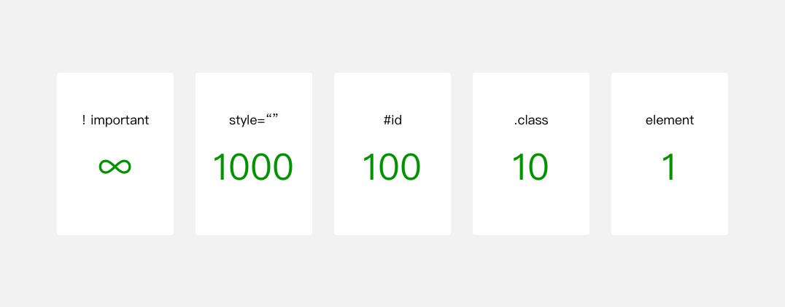

### 微信小程序 起步

[1]  [官方文档](https://developers.weixin.qq.com/miniprogram/dev/framework/quickstart/code.html#WXML-%E6%A8%A1%E6%9D%BF)

[2]  [小程序开发指南](https://developers.weixin.qq.com/ebook?action=get_post_info&docid=000282c19bc1a88b0086ad44e5b80a)

### 渲染层和逻辑层

小程序的渲染层和逻辑层分别由2个线程管理：渲染层的界面使用了WebView  进行渲染；逻辑层采用JsCore线程运行JS脚本。一个小程序存在多个界面，所以渲染层存在多个WebView线程，这两个线程的通信会经由微信客户端（下文中也会采用Native来代指微信客户端）做中转，逻辑层发送网络请求也经由Native转发，小程序的通信模型下图所示。

关系图如下：


### 小程序运行流程图


##### 属性值的绑定

代码清单2-8 属性值的绑定

```html
<!-- 正确的写法 -->
<text data-test="{{test}}"> hello world</text>


<!-- 错误的写法  -->
<text data-test={{test}}> hello world </text >
```

需要注意的是变量名是大小写敏感的

##### 逻辑语法

三元运算：

```html
<!-- 根据 a 的值是否等于 10 在页面输出不同的内容 -->
<text>{{ a === 10? "变量 a 等于10": "变量 a 不等于10"}}</text>
```

算数运算：

```html
<!--
{ a: 1,  b: 2, c: 3 }
-->

<view> {{a + b}} + {{c}} + d </view>

<!-- 输出 3 + 3 + d -->
```

##### 条件逻辑

```html
<view wx:if="{{length > 5}}"> 1 </view>
<view wx:elif="{{length > 2}}"> 2 </view>
<view wx:else> 3 </view>
```

##### 列表渲染

使用 wx:for-item 指定数组当前元素的变量名，使用 wx:for-index 指定数组当前下标的变量名：

```html
<view wx:for="{{array}}" wx:for-index="idx" wx:for-item="itemName">
  {{idx}}: {{itemName.message}}
</view>

<!-- 默认为index和item -->
```

类似 `block wx:if` ，也可以将 `wx:for` 用在 `<block/>` 标签上，以渲染一个包含多节点的结构块。例如：

```html
<block wx:for="{{[1, 2, 3]}}">
  <view> {{index}}: </view>
  <view> {{item}} </view>
</block>
```

如果列表中项目的位置会动态改变或者有新的项目添加到列表中，并且希望列表中的项目保持自己的特征和状态（如 `<input/>` 中的输入内容， `<switch/>` 的选中状态），需要使用 `wx:key` 来指定列表中项目的唯一的标识符。

`wx:key` 的值以两种形式提供：

1. 字符串，代表在 for 循环的 array 中 item 的某个 property，该 property 的值需要是列表中唯一的字符串或数字，且不能动态改变。

2. 保留关键字 this 代表在 for 循环中的 item 本身，这种表示需要 item 本身是一个唯一的字符串或者数字，如：

   ```html
   <switch wx:for="{{numberArray}}" wx:key="*this" > {{item}} </switch>
   <button bindtap="addNumberToFront"> Add Number to the front </button>
   ```

当数据改变触发渲染层重新渲染的时候，会校正带有 key 的组件，框架会确保他们被重新排序，而不是重新创建，以确保使组件保持自身的状态，并且提高列表渲染时的效率。

##### 引用

WXML 提供两种文件引用方式import和include。

import 可以在该文件中使用目标文件定义的 template，如：

在 item.wxml 中定义了一个叫 item的 template ：

```html
<!-- item.wxml -->
<template name="item">
  <text>{{text}}</text>
</template>
```

在 index.wxml 中引用了 item.wxml，就可以使用 item模板：

```html
<import src="item.wxml"/>

<template is="item" data="{{text: 'forbar'}}"/>
```

include 可以将目标文件中除了 `<template/> <wxs/>` 外的整个代码引入，相当于是拷贝到 include 位置，如代码2-22、代码2-23、代码2-24所示。

##### 共同属性

所有wxml 标签都支持的属性称之为共同属性，如表2-1所示。

表2-1 共同属性

| **属性名**   | **类型**     | **描述**       | **注解**                                 |
| ------------ | ------------ | -------------- | ---------------------------------------- |
| id           | String       | 组件的唯一标识 | 整个页面唯一                             |
| class        | String       | 组件的样式类   | 在对应的 WXSS 中定义的样式类             |
| style        | String       | 组件的内联样式 | 可以动态设置的内联样式                   |
| hidden       | Boolean      | 组件是否显示   | 所有组件默认显示                         |
| data-*       | Any          | 自定义属性     | 组件上触发的事件时，会发送给事件处理函数 |
| bind*/catch* | EventHandler | 组件的事件     |                                          |

### 样式

WXSS与Web开发中的CSS类似。为了更适合小程序开发，WXSS对CSS做了一些补充以及修改。

项目公共样式：根目录中的app.wxss为项目公共样式，它会被注入到小程序的每个页面。页面样式：与app.json注册过的页面同名且位置同级的WXSS文件。比如图2-8  app.json注册了pages/rpx/index页面，那pages/rpx/index.wxss为页面pages/rpx/index.wxml的样式。

其它样式：其它样式可以被项目公共样式和页面样式引用，引用方法查看本章中的2.3.3小节。

在小程序开发中，开发者不需要像Web开发那样去优化样式文件的请求数量，只需要考虑代码的组织即可。样式文件最终会被编译优化，具体的编译原理我们留在后面章节再做介绍。

##### 尺寸单位

在WXSS中，引入了rpx（responsive pixel）尺寸单位。引用新尺寸单位的目的是，适配不同宽度的屏幕，开发起来更简单。

##### WXSS引用

在小程序中，我们依然可以实现样式的引用，样式引用是这样写：

```css
@import './test_0.wxss'
```

由于WXSS最终会被编译打包到目标文件中，用户只需要下载一次，在使用过程中不会因为样式的引用而产生多余的文件请求。

##### 内联样式

```html
<!--index.wxml-->

<!--内联样式-->
<view style="color: red; font-size: 48rpx"></view>
```

小程序支持动态更新内联样式：

```html
<!--index.wxml-->

<!--可动态变化的内联样式-->
<!--
{
  eleColor: 'red',
  eleFontsize: '48rpx'
}
-->
<view style="color: {{eleColor}}; font-size: {{eleFontsize}}"></view>
```

##### 选择器

目前支持的选择器如表2-2所示。

表2-2 小程序WXSS支持的选择器

| **类型**     | **选择器** | **样例**      | **样例描述**                                   |
| ------------ | ---------- | ------------- | ---------------------------------------------- |
| 类选择器     | .class     | .intro        | 选择所有拥有 class="intro" 的组件              |
| id选择器     | #id        | #firstname    | 选择拥有 id="firstname" 的组件                 |
| 元素选择器   | element    | view checkbox | 选择所有文档的 view 组件和所有的 checkbox 组件 |
| 伪元素选择器 | ::after    | view::after   | 在 view 组件后边插入内容                       |
| 伪元素选择器 | ::before   | view::before  | 在 view 组件前边插入内容                       |

WXSS优先级与CSS类似，权重如图2-13所示。



```css
view{ // 权重为 1
  color: blue
}

.ele{ // 权重为 10
  color: red
}

#ele{ // 权重为 100
  color: pink
}

view#ele{ // 权重为 1 + 100 = 101，优先级最高，元素颜色为orange
  color: orange
}

view.ele{ // 权重为 1 + 10 = 11
  color: green
}
```

##### 官方样式库

包含button、cell、dialog、progress、toast、article、actionsheet、icon等各式原生。

具体使用文档可参考：https://github.com/Tencent/weui-wxss

### JAVASCRIPT

##### 模块化

```javascript
// moduleA.js
module.exports = function( value ){
  return value * 2;
}
```

```javascript
// B.js

// 在B.js中引用模块A
var multiplyBy2 = require('./moduleA')
var result = multiplyBy2(4)
```

##### 执行顺序

而在小程序中的脚本执行顺序有所不同。小程序的执行的入口文件是 app.js 。并且会根据其中 require 的模块顺序决定文件的运行顺序，代码2-30是一个 app.js 示例。

代码清单2-30  app.js

```javascript
/* a.js
console.log('a.js')
*/
var a = require('./a.js')
console.log('app.js')

/* b.js
console.log('b.js')
*/
var b = require('./b.js')
```

```json
{
  "pages": [
    "pages/index/index",
    "pages/log/log",
    "pages/result/result"
  ],
  "window": {}
}
```

```js
// 以上文件执行后输出的结果如下：
app.js

pages/index/index

pages/log/log

pages/result/result
```

### 程序与页面

##### 全局数据栈

以小程序切换页面时，小程序逻辑层的JS脚本运行上下文依旧在同一个JsCore线程中。
在上文中说道App实例是单例的，因此不同页面直接可以通过App实例下的属性来共享数据。App构造器可以传递其他参数作为全局属性以达到全局共享数据的目的。
代码清单3-6 小程序全局共享数据

```javascript
// app.js
App({
  globalData: 'I am global data' // 全局共享数据
})
// 其他页面脚本other.js
var appInstance = getApp()
console.log(appInstance.globalData) // 输出: I am global data
```

##### 页面

```javascript
{
  "pages":[
    "pages/index/page", // 第一项默认为首页
    "pages/other/other"
  ]
}
```

页面的钩子函数

表3-4 Page构造器的参数

| 参数属性          | 类型     | 描述                                                         |
| :---------------- | :------- | :----------------------------------------------------------- |
| data              | Object   | 页面的初始数据                                               |
| onLoad            | Function | 生命周期函数--监听页面加载，触发时机早于onShow和onReady      |
| onReady           | Function | 生命周期函数--监听页面初次渲染完成                           |
| onShow            | Function | 生命周期函数--监听页面显示，触发事件早于onReady              |
| onHide            | Function | 生命周期函数--监听页面隐藏                                   |
| onUnload          | Function | 生命周期函数--监听页面卸载                                   |
| onPullDownRefresh | Function | 页面相关事件处理函数--监听用户下拉动作                       |
| onReachBottom     | Function | 页面上拉触底事件的处理函数                                   |
| onShareAppMessage | Function | 用户点击右上角转发                                           |
| onPageScroll      | Function | 页面滚动触发事件的处理函数                                   |
| 其他              | Any      | 可以添加任意的函数或数据，在Page实例的其他函数中用 this 可以访问 |

 使用setData更新渲染层数据

```javascript
// page.js
Page({
  onLoad: function(){
    this.setData({
      text: 'change data'
    }, function(){
      // 在这次setData对界面渲染完毕后触发
    })
  }
})
```

此外需要注意以下3点：

1. 直接修改 Page实例的this.data 而不调用 this.setData 是无法改变页面的状态的，还会造成数据不一致。
2. 由于setData是需要两个线程的一些通信消耗，为了提高性能，每次设置的数据不应超过1024kB。
3. 不要把data中的任意一项的value设为undefined，否则可能会有引起一些不可预料的bug。

##### 页面的用户行为

小程序宿主环境提供了四个和页面相关的用户行为回调：

1. 下拉刷新 onPullDownRefresh
   监听用户下拉刷新事件，需要在app.json的window选项中或页面配置page.json中设置enablePullDownRefresh为true。当处理完数据刷新后，wx.stopPullDownRefresh可以停止当前页面的下拉刷新。
2. 上拉触底 onReachBottom
   监听用户上拉触底事件。可以在app.json的window选项中或页面配置page.json中设置触发距离onReachBottomDistance。在触发距离内滑动期间，本事件只会被触发一次。
3. 页面滚动 onPageScroll
   监听用户滑动页面事件，参数为 Object，包含 scrollTop 字段，表示页面在垂直方向已滚动的距离（单位px）。
4. 用户转发 onShareAppMessage
   只有定义了此事件处理函数，右上角菜单才会显示“转发”按钮，在用户点击转发按钮的时候会调用，此事件需要return一个Object，包含title和path两个字段，用于自定义转发内容，如代码清单3-13所示。

##### 页面跳转和路由

表3-5 页面路由触发方式及页面生命周期函数的对应关系

| 路由方式        | 触发时机                   | 路由前页面生命周期 | 路由后页面生命周期 |
| :-------------- | :------------------------- | :----------------- | :----------------- |
| 初始化          | 小程序打开的第一个页面     |                    | onLoad, onShow     |
| 打开新页面 调用 | API wx.navigateTo          | onHide             | onLoad, onShow     |
| 页面重定向 调用 | API wx.redirectTo          | onUnload           | onLoad, onShow     |
| 页面返回 调用   | API wx.navigateBack        | onUnload           | onShow             |
| Tab             | 切换 调用 API wx.switchTab | 请参考表3-6        | 请参考表3-6        |
| 重启动          | 调用 API wx.reLaunch       | onUnload           | onLoad, onShow     |

Tab 切换对应的生命周期（以 A、B 页面为 Tabbar 页面，C 是从 A 页面打开的页面，D 页面是从 C 页面打开的页面为例）如表3-6所示，注意Tabbar页面初始化之后不会被销毁。

表3-6 页面路由触发方式及页面生命周期函数的对应关系

| 当前页面      | 路由后页面  | 触发的生命周期（按顺序）                           |
| :------------ | :---------- | :------------------------------------------------- |
| A             | A           | 无                                                 |
| A             | B           | A.onHide(), B.onLoad(), B.onShow()                 |
| A             | B(再次打开) | A.onHide(), B.onShow()                             |
| C             | A           | C.onUnload(), A.onShow()                           |
| C             | B           | C.onUnload(), B.onLoad(), B.onShow()               |
| D             | B           | D.onUnload(), C.onUnload(), B.onLoad(), B.onShow() |
| D(从转发进入) | A           | D.onUnload(), A.onLoad(), A.onShow()               |
| D(从转发进入) | B           | D.onUnload(), B.onLoad(), B.onShow()               |

### 事件

表3-10 常见的事件类型

| 类型               | 触发条件                                                     |
| :----------------- | :----------------------------------------------------------- |
| touchstart         | 手指触摸动作开始                                             |
| touchmove          | 手指触摸后移动                                               |
| touchcancel        | 手指触摸动作被打断，如来电提醒，弹窗                         |
| touchend           | 手指触摸动作结束                                             |
| tap                | 手指触摸后马上离开                                           |
| longpress          | 手指触摸后，超过350ms再离开，如果指定了事件回调函数并触发了这个事件，tap事件将不被触发 |
| longtap            | 手指触摸后，超过350ms再离开（推荐使用longpress事件代替）     |
| transitionend      | 会在 WXSS transition 或 wx.createAnimation 动画结束后触发    |
| animationstart     | 会在一个 WXSS animation 动画开始时触发                       |
| animationiteration | 会在一个 WXSS animation 一次迭代结束时触发                   |
| animationend       | 会在一个 WXSS animation 动画完成时触发                       |

当事件回调触发的时候，会收到一个事件对象，对象的详细属性如下表所示。

表3-11 事件对象属性

| 属性           | 类型    | 说明                                         |
| :------------- | :------ | :------------------------------------------- |
| type           | String  | 事件类型                                     |
| timeStamp      | Integer | 页面打开到触发事件所经过的毫秒数             |
| target         | Object  | 触发事件的组件的一些属性值集合               |
| currentTarget  | Object  | 当前组件的一些属性值集合                     |
| detail         | Object  | 额外的信息                                   |
| touches        | Array   | 触摸事件，当前停留在屏幕中的触摸点信息的数组 |
| changedTouches | Array   | 触摸事件，当前变化的触摸点信息的数组         |

这里需要注意的是target和currentTarget的区别，currentTarget为当前事件所绑定的组件，而target则是触发该事件的源头组件。

bind事件绑定不会阻止冒泡事件向上冒泡，catch事件绑定可以阻止冒泡事件向上冒泡。如果将上面代码中的第一个capture-bind改为capture-catch，将只触发handleTap2(capture-catch将中断捕获阶段和取消冒泡阶段)

### 用户界面

##### 触摸反馈

设置button的loading属性

```js
<!--page.wxml -->
<button loading="{{loading}}" bindtap="tap">操作</button>

//page.js
Page({
  data: { loading: false },
  tap: function() {
    // 把按钮的loading状态显示出来
    this.setData({
      loading: true
    })
    // 接着做耗时的操作
  }
})
```

##### Toast和模态对话框

显示/隐藏Toast

```javascript
Page({

  onLoad: function() {

    wx.showToast({ // 显示Toast

      title: '已发送',

      icon: 'success',

      duration: 1500

    })

    // wx.hideToast() // 隐藏Toast

  }

})
```

特别要注意，我们不应该把Toast用于错误提示，因为错误提示需要明确告知用户具体原因，因此不适合用这种一闪而过的Toast弹出式提示。一般需要用户明确知晓操作结果状态的话，会使用模态对话框来提示，同时附带下一步操作的指引。

显示模态对话框

```js
Page({
  onLoad: function() {
    wx.showModal({
      title: '标题',
      content: '告知当前状态，信息和解决方法',
      confirmText: '主操作',
      cancelText: '次要操作',
      success: function(res) {
        if (res.confirm) {
          console.log('用户点击主操作')
        } else if (res.cancel) {
          console.log('用户点击次要操作')
        }
      }
    })
  }
})
```

##### 界面滚动

往往手机屏幕是承载不了所有信息的，所以内容区域肯定会超出屏幕区域，用户可以通过滑动屏幕来查看下一屏的内容，这是非常常见的界面滚动的交互。

宿主环境提供了统一的下拉刷新交互，开发者只需要通过配置开启当前页面的下拉刷新，用户往下拉动界面触发下拉刷新操作时，Page构造器的onPullDownRefresh回调会被触发，此时开发者重新拉取新数据进行渲染，实例代码如下所示。

页面下拉刷新

```js
//page.json
{"enablePullDownRefresh": true }

//page.js
Page({
  onPullDownRefresh: function() {
    // 用户触发了下拉刷新操作
    // 拉取新数据重新渲染界面
    // wx.stopPullDownRefresh() // 可以停止当前页面的下拉刷新。
  }
})
```

页面上拉触底

```js
//page.json
// 界面的下方距离页面底部距离小于onReachBottomDistance像素时触发onReachBottom回调
{"onReachBottomDistance": 100 }

//page.js
Page({
  onReachBottom: function() {
    // 当界面的下方距离页面底部距离小于100像素时触发回调
  }
})
```

当然我们有些时候并不想整个页面进行滚动，而是页面中某一小块区域需要可滚动，此时就要用到宿主环境所提供的scroll-view可滚动视图组件。可以通过组件的scroll-x和scroll-y属性决定滚动区域是否可以横向或者纵向滚动，scroll-view组件也提供了丰富的滚动回调触发事件，这部分我们就不再展开细节，读者可以通过scroll-view组件的官方文档了解到细节[[1\]](https://developers.weixin.qq.com/ebook?action=get_post_info&docid=000224fc9d0f98cb0086f4eff5180a#_ftn1)。

##### 发起HTTPS网络通信


##### （重点）微信登录

[微信登录](https://developers.weixin.qq.com/ebook?action=get_post_info&docid=000cc48f96c5989b0086ddc7e56c0a)

客户端、微信与服务器之间关系，绑定用户到服务器

##### （重要）本地数据缓存

##### 读写本地数据缓存

wx.getStorage/wx.getStorageSync读取本地数据缓存

```JS
wx.getStorage({
  key: 'key1',
  success: function(res) {
    // 异步接口在success回调才能拿到返回值
    var value1 = res.data
  },
  fail: function() {
    console.log('读取key1发生错误')
  }
})

try{
  // 同步接口立即返回值
  var value2 = wx.getStorageSync('key2')
}catch (e) {
  console.log('读取key2发生错误')
}
```

wx.getStorage/wx.getStorageSync详细参数

| **参数名** | **类型** | **必填** | **描述**                                                     |
| :--------- | :------- | :------- | :----------------------------------------------------------- |
| key        | String   | 是       | 本地缓存中指定的 key                                         |
| success    | Function | 否       | 异步接口调用成功的回调函数，回调参数格式: {data: key对应的内容} |
| fail       | Function | 否       | 异步接口调用失败的回调函数                                   |
| complete   | Function | 否       | 异步接口调用结束的回调函数（调用成功、失败都会执行）         |

wx.setStorage/wx.setStorageSync写入本地数据缓存

```js
// 异步接口在success/fail回调才知道写入成功与否
wx.setStorage({
  key:"key",
  data:"value1"
  success: function() {
    console.log('写入value1成功')
  },
  fail: function() {
    console.log('写入value1发生错误')
  }
})

try{
  // 同步接口立即写入
  wx.setStorageSync('key', 'value2')
  console.log('写入value2成功')
}catch (e) {
  console.log('写入value2发生错误')
}
```

wx.setStorage/wx.setStorageSync详细参数

| **参数名** | **类型**      | **必填** | **描述**                                             |
| :--------- | :------------ | :------- | :--------------------------------------------------- |
| key        | String        | 是       | 本地缓存中指定的 key                                 |
| data       | Object/String | 是       | 需要存储的内容                                       |
| success    | Function      | 否       | 异步接口调用成功的回调函数                           |
| fail       | Function      | 否       | 异步接口调用失败的回调函数                           |
| complete   | Function      | 否       | 异步接口调用结束的回调函数（调用成功、失败都会执行） |

##### 缓存限制和隔离

小程序宿主环境会管理不同小程序的数据缓存，不同小程序的本地缓存空间是分开的，每个小程序的缓存空间上限为10MB，如果当前缓存已经达到10MB，再通过wx.setStorage写入缓存会触发fail回调。

##### 利用本地缓存持久存储用户登录态SessionId

```js
//page.js
var app = getApp()
Page({
  onLoad: function() {
    // 调用wx.login获取微信登录凭证
    wx.login({
      success: function(res) {
        // 拿到微信登录凭证之后去自己服务器换取自己的登录凭证
        wx.request({
          url: 'https://test.com/login',
          data: { code: res.code },
          success: function(res) {
            var data = res.data
            // 把 SessionId 和过期时间放在内存中的全局对象和本地缓存里边
            app.globalData.sessionId =data.sessionId
            wx.setStorageSync('SESSIONID',data.sessionId)
            // 假设登录态保持1天
            var expiredTime = +new Date() +1*24*60*60*1000
            app.globalData.expiredTime =expiredTime
            wx.setStorageSync('EXPIREDTIME',expiredTime)
          }
        })
      }
    })
  }
})
```

在重新打开小程序的时候，我们把上一次存储的SessionId内容取出来，恢复到内存。

利用本地缓存恢复用户登录态SessionId

```js
//app.js
App({
  onLaunch: function(options) {
    var sessionId =wx.getStorageSync('SESSIONID')
    var expiredTime =wx.getStorageSync('EXPIREDTIME')
    var now = +new Date()
    if (now - expiredTime <=1*24*60*60*1000) {
      this.globalData.sessionId = sessionId
      this.globalData.expiredTime = expiredTime
    }
  },
  globalData: {
    sessionId: null,
    expiredTime: 0
  }
})
```

### 设备能力

例如：获取设备网络状态；调整屏幕亮度等等，我们在这一章节中来介绍其中几种常见的操作设备能力的场景。

##### 利用微信扫码能力

利用wx.scanCode获取二维码的数据

```js
//page.js
Page({
  // 点击“扫码订餐”的按钮，触发tapScan回调
  tapScan: function() {
    // 调用wx.login获取微信登录凭证
    wx.scanCode({
      success: function(res) {
        var num = res.result // 获取到的num就是餐桌的编号
      }
    })
  }
})
```

##### 获取网络状态

利用wx.getNetworkType获取网络状态

```js
//page.js
Page({
  // 点击“预览文档”的按钮，触发tap回调
  tap: function() {
    wx.getNetworkType({
      success: function(res) {
        // networkType字段的有效值：
        // wifi/2g/3g/4g/unknown(Android下不常见的网络类型)/none(无网络)
        if (res.networkType == 'wifi') {
          // 从网络上下载pdf文档
          wx.downloadFile({
            url:'http://test.com/somefile.pdf',
            success: function (res) {
              // 下载成功之后进行预览文档
              wx.openDocument({
                filePath: res.tempFilePath
              })
            }
          })
        } else {
          wx.showToast({ title: '当前为非Wifi环境' })
        }
      }
    })
  }
})
```

### scroll-view

滚动视图  [scroll-view](https://developers.weixin.qq.com/miniprogram/dev/component/scroll-view.html)